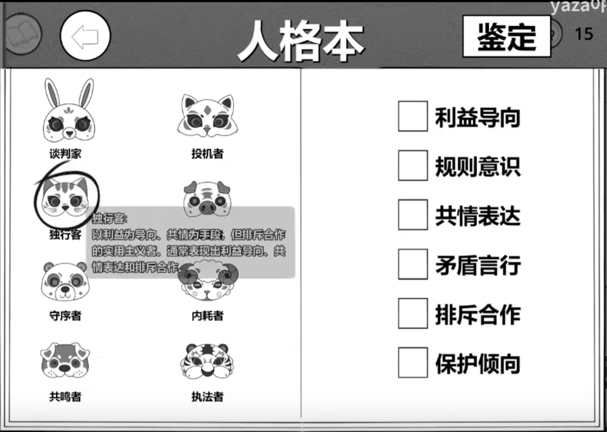

# 2026 Global Gamejam 记录

第一次参加**Global Gamejam**，简单记录一下技术细节以及开发经历。

---
## Brainstorming

由于国内外的开发周期不同，这次主题其实在比赛开始前就已经泄露了😸。依旧是上次NGJ的原班人马，不过由于主题 **“Mask”** 太过困难，直到第一天半夜才想出了大概的玩法，凌晨才有了第一版策划案。  
策划初步决定做的是基于ai对话的剧情推理游戏，大概是通过对话推理某人的人格这种。上一次Agentland项目中，为了实现后端AI的逻辑，队友 **@Astra** 使用了n8n的工作流平台，但这次游戏感觉更为轻量并且不需要多模态，最后决定直接在Godot中请求服务器，由服务器上的Python服务中转收发AI的信息。  
  
---
## Gameplay Development
这次开发的游戏主逻辑交给了 **@Astra** ，由我负责了后端AI的调试和提示词工程。时间紧迫，后端尽可能地选择了轻量化，于是使用`uv`做了项目初始化和虚拟环境创建，然后快速用`flask`搓了一个post api用于接收用户此次请求的参数，并整理提示词后一起发给AI。  
`main.py`belike:
```python
app = Flask(__name__)
@app.route('/api/test', methods=['GET'])
def test():
    return jsonify({
        "status": "success",
        "message": "API is working"
    })
```
```python
@app.route('/api/chat', methods=['POST'])
def chat():
    data = request.json
    player_ip = request.remote_addr
    player_content = data.get('content', "")
    traits = data.get('traits', list())
    background = f"年龄段{data.get('age_group', "")}, 性别{data.get('sex', '')}, 背景故事{data.get('story', '')}"
    patience = data.get('patience')
    prompt = f"{role_prompt} \n {chatrule_prompt} \n 玩家输入问题：{player_content} \n 你应当表现出的特质集合：{traits} \n 你的背景信息：{background} \n 你的耐心值为：{patience}。请根据耐心值调整你的回复长度和详细程度。"
    ai_reply = request_ai(
        message=player_content, 
        api_key=api_key, #type: ignore
        prompt=prompt
    )
    process(ai_reply, traits)
    return jsonify({
        "status": "success",
        "player_ip": player_ip,
        "reply": ai_reply
    })
```
随后在`chat.py`中用`openai`的接口向deepseek v3.2发送整体的请求。  
  
**值得一提的是**，这次对**环境变量**的设置使用了更标准的方法：在项目根目录创建`.env`文件设置环境变量（比如apikey），随后在主程序中这样调用：
```python
from dotenv import load_dotenv
import os

load_dotenv()
api_key = os.getenv("OPENAI_API_KEY") 
```
就可以获取到变量内容。只需要对.env进行gitignore并以安全的方式（比如scp）放到生产环境即可正常运行。

在用同一提示词反复请求deepseek的时候，发生了意想不到的事。当我的提示词为 **“根据某一年龄段/性别/人格特质信息，生成该人的一段背景故事：“** 时，模型回答出现了**极高的重复率**。*（// 几乎每次都会输出名为陈默/林晚的古籍收藏家/钟表修复家）*。即便修改了`temperature`参数仍然无济于事。查询AI后了解到这种语言模型在给定提示词的情况下，会有很高的概率推理得出同一结果，而不是我们所期望的根据更平均随机的概率。  
  
解决方法也很简单粗暴，受到舍友之前**AI生成训练集反过来喂给AI**的启发，我最终在gemini3pro中一次生成了两百条不同的人物性格及故事（长上下文足以保证样本不重复，并且生成效果也不赖），保存为json后在本地随机调用。这样伪随机虽然并非长远之计，但也给了我们在游戏中夹带私货的机会（bushi  
  
通过提示词限定ai返回json文本，在Godot中完成转换逻辑即可完成一整个流程。事实上我完全低估了AI生成json文本的稳定性，原本考虑了很多字符串匹配引号匹配等纠错规则，但实际开发中一个都没用上，也几乎没有出bug。AI果然还是太强大了）  
  
---
## UI Design
写完后端之后就来解救在前端坐牢的队友了。但是队友还是实现了非常流畅的NPC动画，给Godot大手子跪了www。  
在人格本的UI设计和逻辑中，为了实现策划提出的浮窗显示简介的需求，稍微研究了一下浮窗的设计方法。大概是想出了一个比较简单的实现方法，就是定义好一个空的label常驻于场景，在`process()`中不断跟随鼠标的位置，随后根据它所接触的物体来决定是否`Visible`以及`text`填什么。  

本次项目中因为浮窗逻辑比较少，所以直接把文本等写死在了浮窗本身的脚本中。如果要设计更为解耦的方法，也许应该给每个需要浮窗的物体分配一个继承自`Area2D`的类专用于检测浮窗并存储Discription，通过适当设定**Collision**和**Mask**应该可以实现比较解耦的浮窗逻辑。  
  
---
## Music Composition
最开始的想法就是写一个悬疑bgm，但是对于自然小调的和声还是不太会写。最后尝试了`I - bVI - I - bVI`无限循环的和弦进行，尝试利用平行大小调转换来构建一种不和谐感，并设定为三拍子。用简单的电钢琴分解和弦铺底，加入了氛围系的Pad以及高音的简单钢琴旋律。并且尝试了写string并画了Velocity的表情。果然有了力度变化，弦乐的表现力会增色不少。   
<audio controls>
    <source src="/audio/audio_GGJ.mp3" type="audio/mpeg">
    An Audio Here
</audio>
但是奇怪的是做出来后画风竟变得比较温柔了，这才注意到这个进行是只有大三和弦的，虽然旋律尽量往小调靠了，但根据反响总体似乎还是积极的基调（？。不过作为游戏BGM应该也算达成了应有的任务吧，玩的时候还算是挺沉浸的。  
*//感觉上一次NGJ写的偏电子/kawaii的midtempo已经无法超越了，什么时候GGJ能再写一次劲爆音乐呢(((*